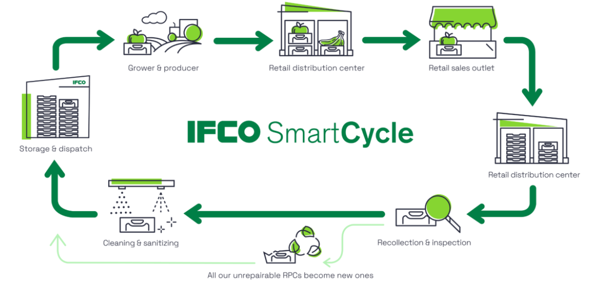

# IFCO SmartCycle Simulation

- [Features](#features)
- [Installation](#installation)
- [Usage](#usage)
- [Methodology](#methodology)
- [Terminology](#terminology)
- [Testing](#testing)
- [Contributing](#contributing)
- [License](#license)

## 🔍 Overview



### For Non-Technical Audience
The IFCO SmartCycle Simulation visualizes and analyzes how reusable packaging containers (RPCs) move through the food supply chain. It helps answer critical business questions:
- What percentage of containers are lost during their journey?
- How many containers are available at any given time?
- How can we ensure we have enough containers to maintain operations?

Our interactive dashboard allows you to adjust parameters and see the impact on container loss rates and pool size over time.

### For Technical Audience
This project implements a stochastic simulation of the IFCO SmartCycle process, modeling how Reusable Packaging Containers (RPCs) circulate through the supply chain. The simulation uses probabilistic models to estimate shrinkage rates and pool size evolution over time.

Key challenges addressed include:
- Accurate estimation of shrinkage rate when only partial trip data is available
- Confidence interval calculations and uncertainty quantification
- Sensitivity analysis to different parameters
- Visualization and communication of results via Streamlit

## ✨ Features

- **Full Visibility Simulation (Scenario One)**: Simulates RPC movement with tracking of 100% of trips
- **Partial Visibility Simulation (Scenario Two)**: Models real-world scenarios where only a fraction of trips can be observed
- **Sensitivity Analysis**: Examines how varying shrinkage rates affect pool size
- **Interactive Visualization**: Streamlit app to explore simulation parameters and results
- **Confidence Interval Calculation**: Statistical rigor for partial visibility scenarios
- **Unit Testing**: Comprehensive testing of core simulation functions

## 🚀 Installation

### Prerequisites
- Python 3.9+
- pip

### Setup Instructions

1. **Clone the repository**
   ```bash
   git clone https://github.com/yourusername/ifco-smartcycle-simulation.git
   cd ifco-smartcycle-simulation
   ```

2. **Create a virtual environment (optional but recommended)**
   ```bash
   python -m venv venv
   source venv/bin/activate  # On Windows: venv\Scripts\activate
   ```

3. **Install dependencies**
   ```bash
   pip install -r requirements.txt
   ```

The `requirements.txt` file contains:
```
numpy==2.0.0
pandas==2.2.2
matplotlib==3.9.1.post1
matplotlib-inline==0.1.7
seaborn==0.13.2
setuptools==78.1.0
scipy==1.14.0
streamlit==1.37.1
typing_extensions==4.12.2
pytest==8.2.1
unittest-xml-reporting==3.2.0
pillow>=10.0.0
```

> **Note**: If you encounter issues with numpy 2.0.0, try downgrading to numpy==1.26.4.

## 💻 Usage

### Running the Streamlit App

```bash
streamlit run ifco_simulation_app.py
```

This will start the app and open it in your default web browser (typically at http://localhost:8501).

### Using the App

1. **Adjust Parameters**: Use the sidebar to modify simulation parameters:
   - Initial pool size
   - True shrinkage rate
   - Mean trip duration
   - Simulation days
   - Trips per day

2. **Run Simulations**:
   - **Scenario One**: 100% visibility of rental dates
   - **Scenario Two**: Partial visibility (adjustable percentage)
   - **Sensitivity Analysis**: Test multiple shrinkage rates

3. **Interpret Results**:
   - View visualizations of trip duration distributions
   - Track pool size over time
   - Compare true vs. estimated shrinkage rates
   - Analyze confidence intervals

### Running the Core Simulation Directly

You can also use the simulation functions directly in your own Python code:

```python
from ifco_simulation_app import simulate_ifco_cycles, simulate_partial_visibility

# Run scenario one simulation
results = simulate_ifco_cycles(
    initial_pool_size=10000,
    true_shrinkage_rate=0.05,
    mean_trip_duration=100,
    simulation_days=1825,
    trips_per_day=10
)

# Access results
print(f"Estimated Shrinkage Rate: {results['estimated_shrinkage_rate']:.4f}")
print(f"Final Pool Size: {results['final_pool_size']}")
```

## 📊 Methodology

The simulation employs these key methodological components:

### 1. Trip Generation and Tracking
- Trip durations are modeled using an exponential distribution (realistic for logistics)
- Each RPC has a probability of being lost during its trip (shrinkage rate)
- Rental and return dates are tracked for each container

### 2. Shrinkage Rate Estimation
- **Scenario One (100% Visibility)**:
  - Define a reasonable "return window" (typically 3-4× mean trip duration)
  - Calculate: `Shrinkage Rate = Number of Unreturned RPCs / Total Number of Trips`

- **Scenario Two (Partial Visibility)**:
  - Sample a subset of trips
  - Apply statistical methods to estimate overall shrinkage rate
  - Calculate confidence intervals based on sample size

### 3. Pool Size Calculation
- `Pool Size(t) = Initial Pool Size + Returns - Rentals`
- Track pool size evolution over time
- Calculate the final pool size and replenishment needs

### 4. Sensitivity Analysis
- Test multiple shrinkage rates to understand impact on pool size
- Evaluate estimation accuracy under different conditions
- Analyze how observation fraction affects estimation reliability

## 📝 Terminology

- **IFCO SmartCycle**: The circular flow of Reusable Packaging Containers (RPCs) through the food supply chain
- **RPC (Reusable Packaging Container)**: Durable containers used to transport food products
- **Trip**: One journey of an RPC from when it leaves a Service Center until it returns
- **Shrinkage Rate**: The probability an RPC is lost during a trip
- **Pool Size**: The total number of RPCs available to IFCO at a given time
- **Return Window**: Timeframe within which non-lost RPCs are expected to return
- **Service Center (SC)**: Facilities where RPCs are processed, cleaned, and dispatched
- **Scenario One**: Simulation where 100% of rental dates are observable
- **Scenario Two**: Simulation where only a fraction of rental dates are observable

## 🧪 Testing

The project includes unit tests for core functionality:

### Running Tests

```bash
python -m unittest test_ifco_simulation_app.py
```

Or with pytest:
```bash
pytest test_ifco_simulation_app.py -v
```

### Test Coverage

The test suite focuses on validating:
- Core simulation functions
- Statistical properties of shrinkage rate estimation
- Proper pool size calculations
- Confidence interval accuracy

> **Note**: Some Streamlit UI tests are implemented as placeholders due to challenges in testing interactive components.

## 📄 License

This project is licensed under the MIT License - see the LICENSE file for details.

---

## Acknowledgments

- IFCO for the problem statement and SmartCycle concept: https://github.com/Digital-IFCO/data-science-test?tab=readme-ov-file
- The circular economy model which inspires sustainable packaging solutions
